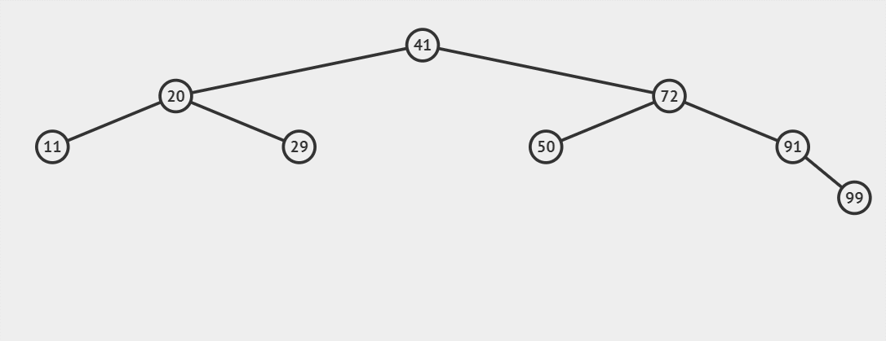

#### 二分查找

##### 1. 二分查找复杂度分析

设有n个元素，则需求解 $\frac{n}{2^k} = 1$

解得 $k = \log_2n$ 所以二分查找的时间复杂度为$O(logn)$

二分查找无需额外空间，所以其空间复杂度为$O(1)$


##### 2. 二分查找实现

###### 2.1 递归方法

```c
int binarySearch(int *nums, int start, int end, int target) {
  if (!nums || start > end)
    return -1;
  int mid = ((end - start) / 2) + start;
  if (target == nums[mid])
    return mid;
  else if (target > nums[mid])
    return binarySearch(nums, mid + 1, end, target);
  else
    return binarySearch(nums, start, mid - 1, target);
}
```

###### 2.2 非递归方法

```c
int nore_binarySearch(int *nums, int size, int target) {
  if (!nums)
    return -1;
  int start = 0;
  int end = size - 1;
  int mid;
  while (start <= end) {
    mid = (end - start) / 2;
    if (target == nums[mid])
      return mid;
    else if (target < nums[mid])
      end = mid - 1;
    else
      start = mid + 1;
  }
  return -1;
}
```


#### 二叉查找树

##### 1. 二叉查找树节点结构

```c
typedef struct BSTNode {
  int val;
  struct BSTNode *left;
  struct BSTNode *right;
} BSTTreeNode;
```


##### 2. 二叉查找树操作

###### 2.1 添加节点

```c
BSTTreeNode *addNode(BSTTreeNode *root, BSTTreeNode *node) {
  if (!root)
    return node;
  if (root->val > node->val)
    root->left = addNode(root->left, node);
  else
    root->right = addNode(root->right, node);
  return root;
}

```


<center>添加值为55的节点</center>


###### 2.2 删除节点

```c
// find parent of most right leaf
BSTTreeNode *mostRightParent(BSTTreeNode *root) {
  if (!root || !root->right)
    return NULL;
  if (!root->right->right)
    return root;
  return mostRightParent(root->right);
}

// find parent of most left leaf
BSTTreeNode *mostLeftParent(BSTTreeNode *root) {
  if (!root || !root->left)
    return NULL;
  if (!root->left->left)
    return root;
  return mostLeftParent(root->left);
}


BSTTreeNode *deleteNode(BSTTreeNode *root, int target) {
  if (!root)
    return NULL;
  // target found
  if (target == root->val) {
    // root is a leaf
    if (root->left == root->right) {
      free(root);
      return NULL;
    } 
    else {
      // try to find most right or left leaf parent
      BSTTreeNode *node = mostLeftParent(root->right);
      if (node) {
        // left leaf parent found
        root->val = node->left->val;
        free(node->left);
        node->left = NULL;
        return root;
      }
      node = mostRightParent(root->left);
      if (node) {
        root->val = node->right->val;
        free(node->right);
        node->right = NULL;
        return root;
      }

      if (root->left) {
        root->left->right = root->right;
        return root->left;
      } else
        return root->right;
    }
  } 
  else if (target < root->val)
    root->left = deleteNode(root->left, target);
  else
    root->right = deleteNode(root->right, target);

  return root;
}
```



<center>删除值为72的节点</center>


###### 2.3 查找节点

```c
BSTTreeNode *search(BSTTreeNode *root, int target) {
  if (!root)
    return NULL;
  if (target == root->val)
    return root;
  else if (target < root->val)
    return search(root->left, target);
  else
    return search(root->right, target);
}
```


<center>查找值为72的节点</center>


<center> 退化为单链表的二叉搜索树搜索过程</center>


##### 3. 二叉查找树操作的复杂度分析

最好情况下，当二叉树为完全二叉树时，其时间复杂度与二分查找相同为$O(\log_2n)$

最坏情况下，当二叉树退化为单链表时，其时间复杂度为$O(n)$


#### 平衡二叉树

> Wiki:
>
> 在[计算机科学](https://zh.wikipedia.org/wiki/计算机科学)中，**AVL树**是最早被发明的[自平衡二叉查找树](https://zh.wikipedia.org/wiki/自平衡二叉查找树)。在AVL树中，任一节点对应的两棵子树的最大高度差为1，因此它也被称为**高度平衡树**。查找、插入和删除在平均和最坏情况下的[时间复杂度](https://zh.wikipedia.org/wiki/时间复杂度)都是$O\log(n)$。增加和删除元素的操作则可能需要借由一次或多次[树旋转](https://zh.wikipedia.org/wiki/树旋转)，以实现树的重新平衡。AVL 树得名于它的发明者 [G. M. Adelson-Velsky](https://zh.wikipedia.org/wiki/格奥尔吉·阿杰尔松-韦利斯基) 和 [Evgenii Landis](https://zh.wikipedia.org/w/index.php?title=Evgenii_Landis&action=edit&redlink=1)，他们在1962年的论文《An algorithm for the organization of information》中公开了这一数据结构。


##### 1. 为什么需要平衡二叉树

> 二叉搜索树一定程度上可以提高搜索效率，但是当原序列有序时，例如序列 A = {1，2，3，4，5，6}，构造二叉搜索树如图 1.1。依据此序列构造的二叉搜索树为右斜树，同时二叉树退化成单链表，搜索效率降低为 O(n)。


##### 2. 平衡二叉树定义

- 平衡二叉树可为空
- 若平衡二叉树不为空，则其每棵子树也都是平衡二叉树


##### 3. 平衡二叉树节点结构体


```c
typedef struct AVLNode{
    int val;					//节点值
    int height;					//此节点高度，定义：一个节点为1，空树高度为0
    struct AVLNode* left;		//左孩子节点指针
    struct AVLNode* right;		//右孩子结点指针
}AVLTreeNode;
```


##### 4. 构建平衡二叉树

###### 左旋和右旋

- 左旋：
  1. 当前节点的右子节点替代当前节点位置
  2. 右子节点的左子树成为当前节点的右子树
  3. 当前节点成为右子节点的左子节点

```c
AVLTreeNode* leftRotate(AVLTreeNode* node){
    if(!node) return NULL;
    //左旋转
    //node右节点的左子树变为node的右子树
    //用node的右节点替代node位置，node成为其右节点的左节点
    //调整高度
    AVLTreeNode* rightNode = node->right;
    node->right= rightNode->left;
    rightNode->left = node;

    node->height = MAX(HEIGHT(node->left), HEIGHT(node->right)) + 1;
    rightNode->height = MAX(HEIGHT(rightNode->right), node->height) + 1;

    return rightNode;
}
```


- 右旋：
  1. 当前节点的左子节点替代当前节点位置
  2. 左子节点的右子树成为当前节点的左子树
  3. 当前节点成为左子节点的右子节点

```c
AVLTreeNode* rightRotate(AVLTreeNode* node){
    if(!node) return NULL;
    //右旋转
    //node左节点的右子树变为node的左子树
    //用node的左节点替代node位置，node成为其左节点的右节点
    //调整height
    AVLTreeNode* leftNode = node->left;
    node->left = leftNode->right;
    leftNode->right = node;

    node->height = MAX(HEIGHT(node->left), HEIGHT(node->right)) + 1;
    leftNode->height = MAX(HEIGHT(leftNode->left), node->height) + 1;

    return leftNode;
}
```


###### 4.1 在根节点的左子树的左节点添加节点导致二叉树失衡

这种情况成为LL型，此时只需对最小失衡树进行一次右旋即可


###### 4.2 在根节点的右子树的右节点添加节点导致二叉树失衡

这种情况称为RR型，此时只需对最小失衡树进行一次左旋即可


###### 4.3 在根节点的左子树的右节点添加节点导致二叉树失衡

这种情况称为LR型，此时需：

	1. 对最小失衡树的根节点的左节点进行左旋
 	2. 对最小失衡树进行右旋


###### 4.4 在根节点的右子树的左节点添加节点导致二叉树失衡

这种情况称为RL型，此时需：

	1. 对最小失衡树的根节点的右节点进行右旋
 	2. 对最小失衡树进行左旋


5. ##### 平衡二叉树操作的复杂度分析

查找：因为平衡二叉树是严格平衡的，所以其查找，最好最坏都是$O(logn)$

插入：每次插入旋转次数都是常数级的，所以插入的时间复杂度也是$O(logn)$

删除：删除节点需要查找到要删除的节点，并要从删除节点开始到根节点路径上所有节点的平衡因子，因此删除操作的时间复杂度为$O(logn) + O(logn) = O(2logn)$，还是$logn$级别的


